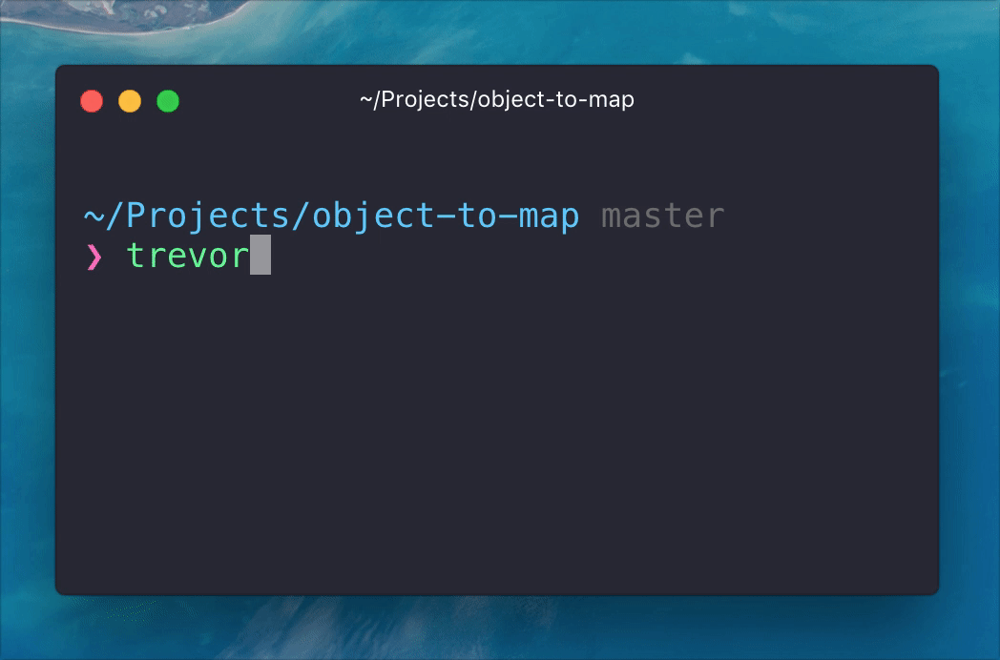

# trevor

Your own Travis CI to run tests locally.

<h1 align="center">
  <br>
  
  <br>
  <br>
  <br>
</h1>


### Purpose

I often need to run tests for multiple versions of Node.js.
But I don't want to switch versions manually using `n`/`nvm` or push the code to Travis CI just to run the tests.

That's why I created Trevor. It reads `.travis.yml` and runs tests in all versions you requested, just like Travis CI.
Now, you can test before push and keep your git history clean.


### Installation

```
$ npm install trevor --global
```


### Usage

```
$ cd my-project
$ trevor
```



**Advice**: Set your test script in `package.json` in `scripts.test` and use the following Makefile:

```
test:
  trevor
```

To run the tests via Trevor, run `make test`. Travis CI will continue to run your tests as before, by reading a command from `package.json`.


### License

MIT © [vdemedes](https://github.com/vdemedes)
